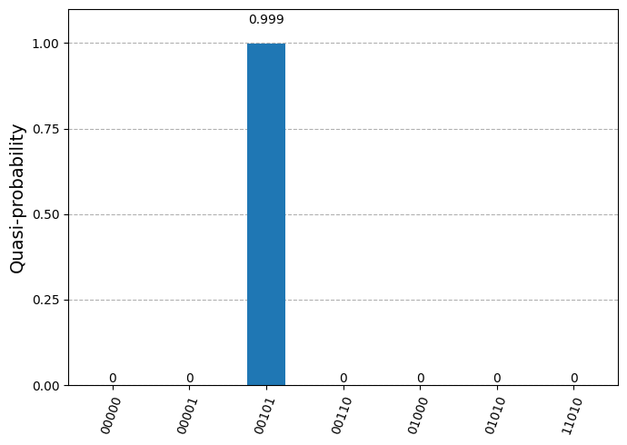

# Quantum Threats to RSA: Shor, Grover, and Post-Quantum ML-KEM

## Overview

This project explores how quantum computing affects RSA encryption and how post-quantum cryptography can respond. The project connects four related experiments into one workflow:

```text
RSA → Classical Factoring → Shor's Algorithm → Grover Search → ML-KEM
```

The project starts with a toy RSA implementation, demonstrates why factoring the RSA modulus breaks RSA, applies Shor's algorithm to recover the factors of a small RSA modulus, uses Grover's algorithm as a quantum search demonstration, and finishes with ML-KEM as a post-quantum key establishment method.

> Important: this is an educational toy-scale project. It does not break real RSA encryption.

---

## Project Motivation

RSA security depends on the difficulty of factoring a large modulus:

```text
n = p × q
```

If an attacker can factor `n`, they can compute Euler's totient:

```text
φ(n) = (p - 1)(q - 1)
```

and recover the private exponent `d`.

Quantum computing changes this security assumption. Shor's algorithm is a direct quantum threat to RSA because it can factor integers efficiently on a sufficiently powerful quantum computer. Grover's algorithm does not directly factor RSA, but it demonstrates quantum search and amplitude amplification. ML-KEM is included as a post-quantum key encapsulation mechanism designed for secure key establishment in a post-quantum setting.

---

## Main Results

| Experiment | Input | Output | Meaning |
|---|---:|---:|---|
| RSA baseline | `p = 3`, `q = 7`, `n = 21` | `c = 17` for `m = 5` | Toy RSA encryption/decryption works |
| Classical factoring | `n = 21` | factors `3` and `7` | Factoring allows private key recovery |
| Shor's algorithm | `N = 21`, `a = 2` | `r = 6`, factors `3` and `7` | Quantum order-finding breaks toy RSA |
| Grover search | public key `(5, 21)`, ciphertext `17` | state `00101` | Quantum search amplifies the correct plaintext |
| ML-KEM | ML-KEM-512/768/1024 | matching shared secrets | Post-quantum key establishment works |

---

## Repository Structure

```text
quantum-rsa-post-quantum-crypto/
│
├── README.md
├── requirements.txt
│
├── notebooks/
│   ├── 01_rsa_baseline_and_factoring.ipynb
│   ├── 02_shor_algorithm.ipynb
│   ├── 03_grover_rsa_plaintext_search.ipynb
│   └── 04_ml_kem_post_quantum_key_establishment.ipynb
│
├── src/
│   ├── __init__.py
│   ├── rsa_demo.py
│   ├── classical_factoring.py
│   ├── shor_order_finding.py
│   ├── grover_rsa_search.py
│   └── ml_kem_demo.py
│
├── figures/
│   ├── rsa_classical_factoring_cost.png
│   ├── shor_measurement_histogram.png
│   ├── grover_simulator_distribution.png
│   └── mlkem_key_ciphertext_size_comparison.png
│
└── report/
    └── Quantum_Threats_to_RSA_Technical_Report.pdf
```

---

## Notebooks

### 1. RSA Baseline and Classical Factoring

Notebook:

```text
notebooks/01_rsa_baseline_and_factoring.ipynb
```

This notebook introduces RSA and shows why factoring is central to RSA security.

It includes:

- small educational RSA key generation
- text encryption/decryption demo
- toy RSA setup using `p = 3`, `q = 7`, `n = 21`
- encryption of `m = 5` into `c = 17`
- classical factoring attack on `n = 21`
- private key recovery after factoring

Core source file:

```text
src/rsa_demo.py
src/classical_factoring.py
```

Run:

```bash
python src/rsa_demo.py
python src/classical_factoring.py
```

---

### 2. Shor's Algorithm for `N = 21`

Notebook:

```text
notebooks/02_shor_algorithm.ipynb
```

This notebook demonstrates the Shor workflow on the toy modulus:

```text
N = 21
a = 2
```

The order is the smallest positive value `r` such that:

```text
2^r ≡ 1 mod 21
```

The notebook shows:

```text
r = 6
```

Then classical post-processing recovers:

```text
gcd(2^(6/2) - 1, 21) = 7
gcd(2^(6/2) + 1, 21) = 3
```

So the recovered factorization is:

```text
21 = 3 × 7
```

Core source file:

```text
src/shor_order_finding.py
```

Fast run using ideal period counts:

```bash
python src/shor_order_finding.py --save-figure
```

Optional Qiskit Aer simulation:

```bash
python src/shor_order_finding.py --simulate --save-figure
```

The simulator option may be slower because the notebook builds a matrix-based modular multiplication gate. This is clear for a toy example but not scalable.

---

### 3. Grover Search on Toy RSA Plaintext

Notebook:

```text
notebooks/03_grover_rsa_plaintext_search.ipynb
```

This notebook uses Grover's algorithm as a quantum search demonstration.

The search task is:

```text
Given public key (e, n) = (5, 21)
and ciphertext c = 17,
find m such that m^5 mod 21 = 17.
```

The correct answer is:

```text
m = 5
```

As a 5-qubit bitstring:

```text
00101
```

Core source file:

```text
src/grover_rsa_search.py
```

Run:

```bash
python src/grover_rsa_search.py --save-figure
```

Expected result:

```text
Most likely bitstring: 00101
Recovered message: 5
```

Important distinction: Grover's algorithm does not directly break RSA by factoring `n`. Shor's algorithm is the direct quantum threat to RSA. Grover is included because it demonstrates quantum search and amplitude amplification.

---

### 4. Post-Quantum ML-KEM Key Establishment

Notebook:

```text
notebooks/04_ml_kem_post_quantum_key_establishment.ipynb
```

This notebook demonstrates ML-KEM, a post-quantum key encapsulation mechanism.

ML-KEM is not direct message encryption. Instead, it allows two parties to establish the same shared secret:

1. Alice generates a public/private key pair.
2. Alice shares her public key.
3. Bob encapsulates a shared secret using Alice's public key.
4. Bob sends the ciphertext to Alice.
5. Alice decapsulates the ciphertext using her private key.
6. Alice and Bob now have the same shared secret.

The notebook compares:

- ML-KEM-512
- ML-KEM-768
- ML-KEM-1024

Core source file:

```text
src/ml_kem_demo.py
```

Recommended workflow for ML-KEM:

```text
Run the ML-KEM notebook in Google Colab first.
```

This is recommended because `liboqs-python` depends on the underlying Open Quantum Safe `liboqs` C library, which can require extra build tools on macOS.

Run locally only after dependencies are installed:

```bash
python src/ml_kem_demo.py --save-figures
```

On macOS, if `liboqs` fails to install, try:

```bash
brew install cmake ninja openssl@3 wget
```

Then restart your terminal or notebook kernel.

---

## Installation

### Option 1: Google Colab

The easiest way to run the notebooks is Google Colab.

For Qiskit notebooks, use:

```python
%pip install -q "qiskit>=2.1.0" "qiskit-aer>=0.17.0" pandas matplotlib pylatexenc
```

For the ML-KEM notebook, use the Colab install cell already included in the notebook.

---

### Option 2: Local Python Environment

Create a virtual environment:

```bash
python3 -m venv .venv
source .venv/bin/activate
```

Install dependencies:

```bash
pip install -r requirements.txt
```

For ML-KEM on macOS, install build tools first:

```bash
brew install cmake ninja openssl@3 wget
```

---

## How to Run the Source Files

Run the RSA baseline:

```bash
python src/rsa_demo.py
```

Run the classical factoring attack:

```bash
python src/classical_factoring.py
```

Run Shor with fast ideal counts:

```bash
python src/shor_order_finding.py --save-figure
```

Run Shor with Qiskit Aer:

```bash
python src/shor_order_finding.py --simulate --save-figure
```

Run Grover simulation:

```bash
python src/grover_rsa_search.py --save-figure
```

Run ML-KEM demo:

```bash
python src/ml_kem_demo.py --save-figures
```

---

## Figures for README

Recommended figures to include in the README:

| Figure | File | Why it matters |
|---|---|---|
| RSA factoring cost | `figures/rsa_classical_factoring_cost.png` | Shows trial division cost for small RSA-like moduli |
| Shor histogram | `figures/shor_measurement_histogram.png` | Shows measurement outcomes used to recover the order |
| Grover distribution | `figures/grover_simulator_distribution.png` | Shows the target state `00101` amplified |
| ML-KEM size comparison | `figures/mlkem_key_ciphertext_size_comparison.png` | Shows public key/ciphertext size tradeoffs |

Example markdown:

```markdown

```

---

## Technical Explanation

### RSA

RSA uses two prime numbers:

```text
p and q
```

The public modulus is:

```text
n = p × q
```

The public key contains `n`, but the factors `p` and `q` are kept secret. If an attacker factors `n`, they can compute:

```text
φ(n) = (p - 1)(q - 1)
```

Then they can recover the private exponent:

```text
d = e^-1 mod φ(n)
```

This project demonstrates that idea using a small toy modulus:

```text
n = 21 = 3 × 7
```

---

### Shor's Algorithm

Shor's algorithm turns factoring into an order-finding problem.

For this project:

```text
N = 21
a = 2
```

The order `r` is:

```text
2^r ≡ 1 mod 21
```

The recovered order is:

```text
r = 6
```

Then:

```text
2^(r/2) = 2^3 = 8
```

and:

```text
gcd(8 - 1, 21) = gcd(7, 21) = 7
gcd(8 + 1, 21) = gcd(9, 21) = 3
```

Therefore:

```text
21 = 3 × 7
```

---

### Grover's Algorithm

Grover's algorithm provides a quadratic speedup for unstructured search.

In this project, Grover searches over possible plaintexts for the toy RSA equation:

```text
m^5 mod 21 = 17
```

The correct plaintext is:

```text
m = 5
```

The 5-qubit binary state is:

```text
00101
```

The oracle marks this state, and Grover's diffuser amplifies its probability.

---

### ML-KEM

ML-KEM is a post-quantum key encapsulation mechanism.

Unlike RSA, ML-KEM is not based on integer factorization. It is designed for post-quantum key establishment.

The shared secret produced by ML-KEM can later be used with symmetric encryption, such as AES.

---

## Limitations

This project is educational and toy-scale.

Important limitations:

- The RSA modulus `n = 21` is intentionally small.
- The Shor implementation does not break real RSA.
- The Shor modular multiplication gate is matrix-based and not scalable.
- The Grover oracle uses a classically precomputed marked state.
- The Grover notebook demonstrates search, not a full RSA-breaking attack.
- The ML-KEM notebook uses a library implementation instead of implementing lattice arithmetic from scratch.
- Runtime measurements depend on the machine, Colab environment, and library versions.

---

## Future Work

Possible improvements:

- Use larger Shor examples.
- Add a cleaner noise comparison between simulator and IBM Quantum hardware.
- Build a fully reversible Grover oracle instead of precomputing the marked state.
- Add hybrid encryption: ML-KEM shared secret → AES key → encrypted message.
- Compare ML-KEM with other post-quantum schemes.
- Add unit tests for each source file.
- Add GitHub Actions to test the RSA and classical factoring source files.

---

## Suggested Resume Bullet

```text
Built an end-to-end quantum cryptography project in Python and Qiskit connecting RSA encryption, classical factoring, Shor's algorithm, Grover search, and post-quantum ML-KEM key establishment.
```

Alternative:

```text
Implemented toy-scale quantum cryptography experiments using Python, Qiskit, and liboqs-python, demonstrating RSA factorization with Shor's algorithm, plaintext search with Grover's algorithm, and post-quantum key establishment with ML-KEM.
```

---

## Suggested LinkedIn Project Description

Built an educational quantum cryptography project studying how quantum algorithms affect RSA encryption and how post-quantum cryptography can respond. The project implements RSA encryption/decryption, demonstrates a classical factoring attack, applies Shor's algorithm to factor a toy RSA modulus, uses Grover's algorithm for quantum search over RSA plaintexts, and implements ML-KEM as a post-quantum key establishment method. Technologies used include Python, Qiskit, Qiskit Aer, NumPy, Pandas, Matplotlib, and liboqs-python.

---

## Author

Harry Do  
Computer Science Student, Binghamton University
